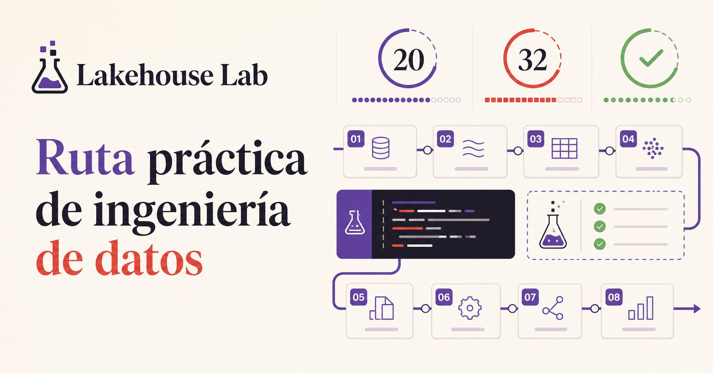

# Lakehouse Lab

Plataforma educativa independiente en español para aprender ingeniería de datos sobre Databricks mediante una ruta de 20 semanas, 32 módulos, laboratorios, evaluaciones y progreso persistente.

> Proyecto personal e independiente. No está afiliado, patrocinado ni avalado por Databricks.

[Explorar el código](https://github.com/jjnv/lakehouse-lab) · [Reportar una incidencia](https://github.com/jjnv/lakehouse-lab/issues)



## Qué incluye

- Portada y demo públicas sin registro.
- Espacio personal anónimo, sin pedir nombre ni correo.
- 160 lecciones, 32 laboratorios y simulacros Associate y Professional.
- Búsqueda global de módulos, lecciones y conceptos con navegación al punto exacto del temario.
- Progreso persistente en Turso y repasos espaciados.
- Evaluaciones corregidas en el servidor sin enviar claves de respuesta al cliente.
- Exportación y eliminación del progreso.
- Credenciales de finalización verificables y exportables en PDF.
- Diseño adaptable y comprobaciones WCAG 2.2 AA.

## Arquitectura

- Next.js 16, React 19 y TypeScript.
- Vercel Functions con el runtime de Node.js.
- Turso Serverless SQLite y Drizzle ORM.
- Sesión anónima mediante una cookie privada, aleatoria, `HttpOnly` y `SameSite`.
- Pruebas de contrato, currículo, renderizado, aislamiento de usuarios y accesibilidad.

Las páginas públicas no requieren identidad. Al empezar, la aplicación crea un identificador aleatorio en el navegador y lo usa como credencial opaca; ninguna API acepta un correo o `userId` enviado por el cliente.

## Publicar en Vercel

1. Importa `jjnv/lakehouse-lab` desde el panel de Vercel.
2. Añade **Turso Cloud** desde el Marketplace de Vercel y conéctalo al proyecto. La integración crea `TURSO_DATABASE_URL` y `TURSO_AUTH_TOKEN`.
3. Opcionalmente define `NEXT_PUBLIC_SITE_URL` con el dominio definitivo para los metadatos sociales.
4. Ejecuta un nuevo despliegue. El proceso aplica las migraciones pendientes y compila la aplicación automáticamente.

La configuración incluida fija el preset de Next.js, la región europea y el flujo de compilación. Los secretos permanecen en Vercel y nunca se guardan en el repositorio.

## Desarrollo local

Requisitos: Node.js `>=22.13.0`.

```bash
npm ci
npm run dev
```

Sin variables de Turso se utiliza una base SQLite local dentro de `.data/`. Para trabajar con una base remota:

```dotenv
TURSO_DATABASE_URL=libsql://...
TURSO_AUTH_TOKEN=...
```

## Comprobaciones

```bash
npm run lint
npm test
npm run test:e2e
```

## Desarrollo asistido con Codex

El repositorio incluye instrucciones y agentes especializados para trabajar con
Codex sin tener que repetir la arquitectura y los criterios de calidad en cada
tarea:

- `AGENTS.md` define invariantes, propiedad de archivos y comprobaciones.
- `.codex/agents/` contiene perfiles para producto, frontend, backend, datos,
  seguridad, currículo, calidad y release.
- `.codex/config.toml` habilita la coordinación de hasta tres subagentes.

Para cambios pequeños basta con describir el resultado esperado. En cambios de
riesgo alto puedes pedir explícitamente un propietario y revisores, por ejemplo:

```text
Implementa esta mutación con backend_domain_api como propietario. Cuando
termine, haz que security_privacy y quality_engineering revisen el cambio y
consolida los hallazgos con referencias a archivos y pruebas.
```

Consulta la [guía de uso de los agentes](.codex/README.md) para ver flujos,
plantillas y ejemplos completos.

## Privacidad y contenido

La demo pública no guarda progreso. El espacio personal informa de los datos tratados y permite exportar o eliminar la actividad. El contenido se redacta de forma original y enlaza documentación oficial; no contiene dumps de exámenes ni promete aprobar una certificación.

Versión editorial: **2026.07**. Última revisión: **22 de julio de 2026**.

## Licencias

El código fuente se publica bajo licencia MIT. El contenido educativo de `app/curriculum/` y los bancos de preguntas se distribuye bajo **Creative Commons Attribution-NonCommercial-ShareAlike 4.0 International**. Consulta [LICENSE](LICENSE) y [CONTENT-LICENSE.md](CONTENT-LICENSE.md).
