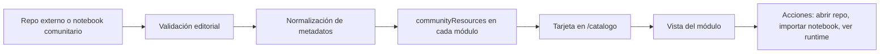

# Notebooks comunitarios para complementar Lakehouse Lab

## Resumen ejecutivo

He interpretado el catálogo de **Lakehouse Lab** a partir de la implementación publicada del sitio: la ruta `/catalogo` renderiza `CatalogWorkspace` con `moduleSummaries()`, y esas `moduleSummaries()` salen de un conjunto de **32 módulos** agrupados en **6 fases** de aprendizaje. En la página visible pública se distinguen claramente cinco bloques temáticos principales, pero el código añade además una sexta fase de cierre, **Convergencia Professional**. Por esa razón, y siguiendo tu instrucción de “si el mapeo no está claro, tratar los temas tal como se extraen”, he tratado **cada módulo** como una **subtopic curricular** y el array `topics[]` de cada módulo como sus **conceptos secundarios**. citeturn16view0turn20view0turn25view0turn26view0turn27view0turn7view0

La cobertura comunitaria es **muy buena** para **Spark, PySpark, Delta Lake, Structured Streaming, Lakeflow/DLT, Workflows, Bundles, Unity Catalog básico y FinOps con system tables**; es **aceptable** para **privacidad avanzada en Unity Catalog**; y es **más débil** para **OpenSharing/Federation** y para algunos detalles de **compute clásico/serverless/SQL warehouses**, donde abundan más tutoriales y repos de apoyo que notebooks “didácticos” puros. Cuando no encontré un notebook exacto y abierto que enseñe el concepto de forma aislada, prioricé el mejor **repo equivalente, runnable en Databricks, con pasos reproducibles** y lo marqué como tal. citeturn36view0turn44view0turn41search2turn30view0turn32view0turn34view0turn40view0turn45view0turn38view0turn39view0

Mi recomendación principal es **no enlazar un recurso externo por cada palabra clave superficial del catálogo**, sino **anclar 3 recursos curados por módulo** y luego reutilizar metadatos de dificultad, runtime, licencia y conceptos para filtrado. Eso reduce ruido, permite reutilizar repos fuertes en varios módulos, y encaja mejor con el modelo de `moduleSummaries()` que ya usa tu sitio. citeturn20view0turn25view0turn26view0turn27view0

## Cómo interpreté el catálogo

El catálogo fuente define estas fases:

| Fase | Subtopics extraídos |
|---|---|
| **Fundamentos lakehouse** | m01 Data Intelligence Platform y arquitectura lakehouse; m02 Compute clásico, serverless y SQL warehouses; m03 Notebooks, SQL, Python y PySpark en el workspace; m04 DataFrames, transformaciones y datos complejos; m05 Catalyst, particiones, joins y shuffles; m06 Delta Lake: ACID, esquema, historial y DML; m07 Arquitectura medallion, calidad y modelado; m08 Ingesta batch, formatos, COPY INTO, JDBC y REST; m09 Auto Loader y Lakeflow Connect; m10 Lakeflow Jobs: DAG, tareas y triggers; m11 Unity Catalog, Git folders y CI/CD esencial; m12 Proyecto Associate y simulacro de 45 preguntas. citeturn25view0turn26view0 |
| **Streaming y CDC** | m13 Structured Streaming, triggers y checkpoints; m14 Estado, ventanas, watermarks y datos tardíos; m15 Kafka, buses de eventos y garantías de entrega; m16 Change Data Feed, CDC, AUTO CDC y SCD; m17 Proyecto de streaming con SLA. citeturn26view0turn27view0 |
| **Pipelines y orquestación** | m18 Spark Declarative Pipelines en Lakeflow; m19 Expectations, cuarentena y event logs; m20 Lakeflow Jobs avanzado: control flow y repairs; m21 Triggers, alertas, backfills y operación; m22 Proyecto de pipeline declarativo. citeturn27view0 |
| **Rendimiento y FinOps** | m23 Tuning avanzado de Spark; m24 Photon, data skipping y liquid clustering; m25 Compute, políticas, etiquetas y costes; m26 Spark UI, Query Profile y system tables; m27 Proyecto de fiabilidad y coste. citeturn27view0 |
| **Entrega y gobierno** | m28 Proyectos Python, dependencias y pruebas; m29 Declarative Automation Bundles y CI/CD; m30 Unity Catalog avanzado y privacidad; m31 OpenSharing y Federation. citeturn27view0 |
| **Convergencia Professional** | m32 Proyecto Professional y simulacro de 59 preguntas. citeturn20view0turn27view0 |

**Decisión metodológica importante.** El render de `/catalogo` no expone un listado estático simple en el HTML público; el sitio lo construye desde `moduleSummaries()`. Por eso el inventario anterior no es una “suposición”: sale del código que alimenta el catálogo. citeturn16view0turn20view0

## Fundamentos lakehouse

Los módulos de esta fase cubren desde el **modelo mental lakehouse** hasta **ingesta, Delta, Jobs, Unity Catalog y un proyecto Associate**. Para mantener el informe útil —y no inflarlo con notebooks de baja calidad— he priorizado repositorios que sirven como “spines” de aprendizaje repetibles: **learn-databricks**, **azure-databricks-exercise**, **delta-examples**, **notebook-best-practices**, **bundle-examples**, **yokawasa/databricks-notebooks**, **Startup ERP Data Lakehouse** y algún demo oficial equivalente cuando aportaba algo único. citeturn36view0turn44view0turn41search2turn34view0turn32view0turn40view0turn39view0

| Módulo | Recurso recomendado 1 | Recurso recomendado 2 | Recurso recomendado 3 |
|---|---|---|---|
| **m01 Arquitectura lakehouse** | **[Learn Databricks](https://github.com/jaceklaskowski/learn-databricks)** — Repositorio amplio con carpetas explícitas para **Apache Spark, Delta Lake, Lakeflow, Unity Catalog, Workflows y Bundles**. No es un único notebook, sino una base muy sólida para enseñar la arquitectura de la plataforma y cómo se encajan sus superficies. **Conceptos:** arquitectura lakehouse, Spark, Delta, UC, Workflows. **Compat.:** estimada para DBR reciente; repo basado en notebooks/Jupyter y contenido Databricks. **Licencia:** Apache-2.0. **Fuente:** Jacek Laskowski. **Dificultad:** intermedio. citeturn36view0 | **[Startup ERP Data Lakehouse](https://github.com/Caliu-Data/databricks-startups-metrics)** — Implementa un lakehouse completo con capas Bronze/Silver/Gold, datos ERP sintéticos, controles GDPR e ISO 27001 y métricas de negocio. Es especialmente bueno para aterrizar la arquitectura lakehouse completa en un caso práctico legible. **Conceptos:** medallion, gobierno, KPIs, seguridad. **Compat.:** declara Unity Catalog y DBR 13.0+ con Python 3.10+. **Licencia:** Apache-2.0 visible en el repo. **Fuente:** Caliu-Data. **Dificultad:** intermedio. citeturn39view0 | **[Databricks Free Declarative Pipelines](https://github.com/andkret/Databricks-Free-Declarative-Pipelines)** — Curso práctico sobre pipelines declarativos y arquitectura medallion en Databricks Free Edition con dataset de comercio electrónico. Aunque está orientado a Lakeflow, funciona muy bien como visión de arquitectura end-to-end. **Conceptos:** Delta, medallion, UC, pipelines, streaming. **Compat.:** pensado para Databricks Free Edition; SQL y Lakeflow Designer. **Licencia:** sin licencia visible en el repositorio. **Fuente:** andkret. **Dificultad:** intermedio. citeturn37search0turn37search6 |
| **m02 Compute clásico, serverless y SQL warehouses** | **[Azure Databricks Hands-on](https://github.com/tsmatsuz/azure-databricks-exercise)** — Incluye ejercicios separados para **Databricks SQL**, PySpark, streaming y orquestación, más instrucciones explícitas para importar `HandsOn.dbc` y ejecutar en compute Databricks. Es mejor para aprender “qué tipo de compute uso y cuándo” que la mayoría de notebooks sueltos. **Conceptos:** Databricks SQL, compute all-purpose vs job, import `.dbc`. **Compat.:** requiere Azure Databricks; el README indica classic compute para parte de los ejercicios. **Licencia:** sin licencia visible. **Fuente:** Tsuyoshi Matsuzaki. **Dificultad:** principiante-intermedio. citeturn44view0 | **[databricks-sql-start-stop](https://github.com/guanjieshen/databricks-sql-start-stop)** — Notebook orientado a automatizar el arranque/parada/configuración de **SQL Warehouses** usando **Databricks Workflows**. No enseña arquitectura completa, pero sí la operación real de warehouses, muy útil para este módulo. **Conceptos:** SQL warehouses, automatización, Workflows. **Compat.:** notebook para Databricks; requiere permisos sobre el warehouse del principal que ejecuta el job. **Licencia:** no visible en el resultado indexado. **Fuente:** guanjieshen. **Dificultad:** intermedio. citeturn42search1 | **[Learn Databricks](https://github.com/jaceklaskowski/learn-databricks)** — Como repositorio transversal, también cubre **Databricks SQL**, **Workflows** y material de administración. Lo recomiendo como tercera pieza porque evita que el alumno entienda SQL Warehouses como una isla separada del resto de la plataforma. **Conceptos:** SQL, Workflows, administración. **Compat.:** estimada para DBR reciente. **Licencia:** Apache-2.0. **Fuente:** Jacek Laskowski. **Dificultad:** intermedio. citeturn36view0 |
| **m03 Notebooks, SQL, Python y PySpark** | **[notebook-best-practices](https://github.com/databricks/notebook-best-practices)** — Ejemplo hands-on de buenas prácticas para notebooks Databricks: Repos, extracción de código reutilizable, tests, jobs programados y CI/CD opcional. Es probablemente el recurso más “didáctico” para enseñar cómo pasar de notebook exploratorio a artefacto mantenible. **Conceptos:** notebooks, Repos, testing, jobs, CI/CD. **Compat.:** Databricks notebooks; Python. **Licencia:** Apache-2.0. **Fuente:** Databricks. **Dificultad:** intermedio. citeturn34view0 | **[Azure Databricks Hands-on](https://github.com/tsmatsuz/azure-databricks-exercise)** — Los ejercicios 2 y 3 cubren **PySpark, DataFrames y transformación** y vienen empaquetados como `HandsOn.dbc`, lo que facilita importarlos tal cual en un workspace. Es muy bueno para alumnos que necesitan una ruta lineal paso a paso. **Conceptos:** PySpark, DataFrames, notebooks importados. **Compat.:** Azure Databricks; `HandsOn.dbc` importable. **Licencia:** sin licencia visible. **Fuente:** Tsuyoshi Matsuzaki. **Dificultad:** principiante. citeturn44view0 | **[Learn Databricks](https://github.com/jaceklaskowski/learn-databricks)** — Tiene carpetas específicas para **PySpark** y **Python**, además de material Databricks nativo. Es menos “tutorial lineal” que el repo anterior, pero mejor como referencia acumulativa para el alumno que ya empezó a programar en notebooks. **Conceptos:** PySpark, Python, Databricks. **Compat.:** estimada para DBR reciente. **Licencia:** Apache-2.0. **Fuente:** Jacek Laskowski. **Dificultad:** intermedio. citeturn36view0 |
| **m04 DataFrames, transformaciones y datos complejos** | **[Azure Databricks Hands-on](https://github.com/tsmatsuz/azure-databricks-exercise)** — Cubre **Basics of PySpark, Spark DataFrame** y transformación de datos como ejercicios separados. Para este módulo es el recurso más directo porque sí está diseñado como laboratorio paso a paso. **Conceptos:** DataFrames, transformaciones, preparación de datos. **Compat.:** Azure Databricks; importación `.dbc`. **Licencia:** sin licencia visible. **Fuente:** Tsuyoshi Matsuzaki. **Dificultad:** principiante. citeturn44view0 | **[Learn Databricks](https://github.com/jaceklaskowski/learn-databricks)** — La carpeta **PySpark** del repo lo convierte en una buena referencia complementaria cuando el alumno quiere salir del laboratorio lineal y revisar ejemplos concretos. **Conceptos:** DataFrames, expresiones Spark, PySpark. **Compat.:** estimada para DBR reciente. **Licencia:** Apache-2.0. **Fuente:** Jacek Laskowski. **Dificultad:** intermedio. citeturn36view0 | **[Databricks Jump Start Sample Notebooks](https://github.com/dennyglee/databricks)** — Repositorio veterano con notebooks en Python, Scala, SQL y R; el autor remarca que la mayoría corre en **Databricks Community Edition**. Útil para ampliar ejemplos de exploración y DataFrames con casos reales. **Conceptos:** notebooks Databricks, DataFrames, exploración. **Compat.:** la mayoría corre en Community Edition según el README. **Licencia:** no visible en la página del repo. **Fuente:** Denny Lee. **Dificultad:** principiante-intermedio. citeturn43view0 |
| **m05 Catalyst, particiones, joins y shuffles** | **[Learn Databricks](https://github.com/jaceklaskowski/learn-databricks)** — La parte de **Apache Spark** del repo es la mejor puerta de entrada comunitaria de esta lista para enseñar **Catalyst, ejecución Spark y tuning conceptual** sin caer en recetas sueltas. **Conceptos:** Spark execution, optimización, planes. **Compat.:** estimada para DBR reciente. **Licencia:** Apache-2.0. **Fuente:** Jacek Laskowski. **Dificultad:** intermedio-avanzado. citeturn36view0 | **[On-Time Flight Performance y otros notebooks](https://github.com/dennyglee/databricks)** — El repo incluye notebooks de grafos, exploración y streaming con Spark; como material de apoyo sirve para analizar ejecución y particionado sobre casos menos artificiales. **Conceptos:** Spark jobs, paralelismo, DataFrames. **Compat.:** mayoría en Community Edition. **Licencia:** no visible. **Fuente:** Denny Lee. **Dificultad:** intermedio. citeturn43view0 | **[databricks-examples](https://github.com/data-engineering-helpers/databricks-examples)** — Repositorio de ejemplos y anti-patrones con Spark/Databricks; no es tan pulido como un curso oficial, pero es útil para ilustrar “buenas y malas prácticas” en procesamiento Spark. **Conceptos:** Spark, prácticas de rendimiento, código Databricks. **Compat.:** repo de ejemplos Spark/Databricks. **Licencia:** no visible en el resultado indexado. **Fuente:** data-engineering-helpers. **Dificultad:** intermedio. citeturn42search6 |
| **m06 Delta Lake: ACID, esquema, historial y DML** | **[01_quickstart.ipynb](https://github.com/delta-io/delta-examples/blob/master/notebooks/pyspark/01_quickstart.ipynb)** — Notebook oficial de **Delta Lake OSS** para aprender el flujo básico de leer/escribir tablas Delta. Es el mejor punto de partida para entender el formato abierto sin mezclar demasiada capa Databricks propietaria. **Conceptos:** Delta básico, ACID, lectura/escritura. **Compat.:** PySpark + Delta; fácilmente adaptable a Databricks. **Licencia:** Apache-2.0 a nivel repo. **Fuente:** delta-io. **Dificultad:** principiante. citeturn41search0turn41search2 | **[create-table-delta-lake.ipynb](https://github.com/delta-io/delta-examples/blob/master/notebooks/pyspark/create-table-delta-lake.ipynb)** — Se centra en creación y manejo de tablas Delta. Complementa muy bien el quickstart cuando el alumno ya necesita relacionar tabla lógica, path físico e historial. **Conceptos:** tablas Delta, schema, operaciones sobre tablas. **Compat.:** PySpark + Delta; runnable en Databricks con DBR reciente. **Licencia:** Apache-2.0. **Fuente:** delta-io. **Dificultad:** principiante-intermedio. citeturn41search26turn41search2 | **[change-data-feed.ipynb](https://github.com/delta-io/delta-examples/blob/master/notebooks/pyspark/change-data-feed.ipynb)** — Notebook específico para **Change Data Feed**, muy útil para enlazar este módulo con el de CDC posterior. Sirve para enseñar DML e historial con un artefacto concreto, no solo con teoría. **Conceptos:** CDF, evolución de cambios, historial Delta. **Compat.:** PySpark + Delta; runnable en Databricks. **Licencia:** Apache-2.0. **Fuente:** delta-io. **Dificultad:** intermedio. citeturn41search29turn41search2 |
| **m07 Medallion, calidad y modelado** | **[Startup ERP Data Lakehouse](https://github.com/Caliu-Data/databricks-startups-metrics)** — Material muy bueno para enseñar medallion “de verdad” porque implementa Bronze/Silver/Gold con motivaciones claras, capas diferenciadas y métricas gold útiles. Además genera datos sintéticos, lo que mejora la reproducibilidad. **Conceptos:** medallion, modelado, calidad, KPIs. **Compat.:** UC + DBR 13+. **Licencia:** Apache-2.0 visible. **Fuente:** Caliu-Data. **Dificultad:** intermedio. citeturn39view0 | **[Databricks Free Declarative Pipelines](https://github.com/andkret/Databricks-Free-Declarative-Pipelines)** — Demuestra medallion con pipeline declarativo y un dataset realista de e-commerce. Es mejor para enseñar el patrón como diseño operacional, no solo como diagrama. **Conceptos:** medallion, silver/gold, pipeline declarativo. **Compat.:** Databricks Free Edition. **Licencia:** sin licencia visible. **Fuente:** andkret. **Dificultad:** intermedio. citeturn37search0turn37search6 | **[kimball_modelling_demo](https://github.com/databricks/delta-live-tables-notebooks)** — Dentro del repo oficial de ejemplos de Delta Live Tables/Lakeflow aparecen demos de modelado tipo Kimball. No es el recurso más autónomo, pero sí uno de los pocos oficiales enfocados a modelado encima de pipelines declarativos. **Conceptos:** modelado dimensional, DLT/Lakeflow, medallion. **Compat.:** DLT/Lakeflow en Databricks. **Licencia:** no visible en README; repo oficial Databricks. **Fuente:** Databricks. **Dificultad:** intermedio. citeturn30view0 |
| **m08 Ingesta batch, formatos, COPY INTO, JDBC y REST** | **[yokawasa/databricks-notebooks](https://github.com/yokawasa/databricks-notebooks)** — Reúne notebooks de operaciones de archivos y dos ejemplos ELT conectando Blob Storage con Cosmos DB y SQL DW. Es de los pocos repos comunitarios pequeños y claros para enseñar ingestión batch con Databricks. **Conceptos:** file ops, ELT, almacenamiento, integración. **Compat.:** Azure Databricks; notebooks Jupyter. **Licencia:** MIT. **Fuente:** yokawasa. **Dificultad:** principiante-intermedio. citeturn40view0 | **[Azure Databricks Integration Demos](https://github.com/mjtpena/azure-databricks-demos)** — Incluye demos específicos para **ADLS Gen2**, **Cosmos DB**, **Key Vault** y **Azure Data Factory**, muy útiles para la parte “JDBC/REST/landing” del módulo. Está mejor documentado que la mayoría de demos de integración en GitHub. **Conceptos:** ADLS Gen2, Cosmos DB, ADF, secretos. **Compat.:** Azure Databricks + Databricks CLI + Terraform opcionales. **Licencia:** MIT. **Fuente:** Michael John Peña. **Dificultad:** intermedio. citeturn45view0 | **[Azure Databricks Hands-on](https://github.com/tsmatsuz/azure-databricks-exercise)** — Aunque es más generalista, trae una secuencia real de laboratorio y ayuda a no separar ingestión batch del resto del flujo Databricks. **Conceptos:** almacenamiento, transformación, orquestación. **Compat.:** Azure Databricks; import `.dbc`. **Licencia:** sin licencia visible. **Fuente:** Tsuyoshi Matsuzaki. **Dificultad:** principiante. citeturn44view0 |
| **m09 Auto Loader y Lakeflow Connect** | **[crdb_to_dbx](https://github.com/rsleedbx/crdb_to_dbx)** — Proyecto centrado en **CDC hacia Databricks Delta Lake** usando cloud storage y **Auto Loader**, con quickstart y configuración explícita. Es el recurso más cercano y abierto que encontré para enseñar Auto Loader de forma aplicada. **Conceptos:** Auto Loader, volúmenes UC, CDC, merge. **Compat.:** Databricks + cloud storage + configuración externa. **Licencia:** no visible en el resultado indexado. **Fuente:** rsleedbx. **Dificultad:** intermedio-avanzado. citeturn41search25 | **[Databricks Free Declarative Pipelines](https://github.com/andkret/Databricks-Free-Declarative-Pipelines)** — No está centrado en Auto Loader como tal, pero sí enseña la parte de **ingestión declarativa y medallion** muy próxima a lo que el alumno necesita entender después de Auto Loader. **Conceptos:** ingestión incremental, medallion, Lakeflow. **Compat.:** Databricks Free Edition. **Licencia:** sin licencia visible. **Fuente:** andkret. **Dificultad:** intermedio. citeturn37search0turn37search7 | **[delta-live-tables-notebooks](https://github.com/databricks/delta-live-tables-notebooks)** — El repo oficial de DLT/Lakeflow no enseña Auto Loader en aislamiento, pero sí la construcción de pipelines declarativos listos para ejecutarse en Databricks. Lo recomiendo como tercer recurso porque conecta ingestión managed con su operacionalización posterior. **Conceptos:** DLT/Lakeflow, pipelines incrementales, tablas streaming. **Compat.:** Delta Live Tables/Lakeflow. **Licencia:** no visible en README. **Fuente:** Databricks. **Dificultad:** intermedio. citeturn30view0 |
| **m10 Lakeflow Jobs: DAG, tareas y triggers** | **[Learn Databricks](https://github.com/jaceklaskowski/learn-databricks)** — El repo incluye una carpeta específica de **Databricks Workflows**, por eso es el mejor punto de partida de esta lista para Jobs y DAGs. También encaja bien con el resto del catálogo porque el alumno no sale del ecosistema Databricks. **Conceptos:** Workflows, Jobs, ejecución programada. **Compat.:** estimada para DBR reciente. **Licencia:** Apache-2.0. **Fuente:** Jacek Laskowski. **Dificultad:** intermedio. citeturn36view0 | **[notebook-best-practices](https://github.com/databricks/notebook-best-practices)** — Además de ingeniería de notebooks, enseña a ejecutarlos de forma programada con un Databricks job. Es un muy buen “puente” entre notebook y workflow de producción. **Conceptos:** jobs, scheduling, código reutilizable. **Compat.:** Databricks notebooks. **Licencia:** Apache-2.0. **Fuente:** Databricks. **Dificultad:** intermedio. citeturn34view0 | **[databricks-sql-start-stop](https://github.com/guanjieshen/databricks-sql-start-stop)** — Recurso de operación de SQL Warehouses desde Workflows; no cubre DAGs generales, pero sí triggers y automatización real en una superficie Databricks nativa. **Conceptos:** Workflows, scheduling, SQL warehouse ops. **Compat.:** requiere permisos sobre el warehouse. **Licencia:** no visible. **Fuente:** guanjieshen. **Dificultad:** intermedio. citeturn42search1 |
| **m11 Unity Catalog, Git folders y CI/CD esencial** | **[bundle-examples](https://github.com/databricks/bundle-examples)** — Repositorio oficial de ejemplos de **Databricks Asset Bundles** con carpetas `default_python`, `default_sql`, `lakeflow_pipelines_python` y `lakeflow_pipelines_sql`. Es el mejor recurso abierto para enseñar promoción entre entornos y recursos como código. **Conceptos:** Bundles, targets, jobs, pipelines. **Compat.:** DAB + Databricks CLI; notebooks y proyectos Python. **Licencia:** DB license. **Fuente:** Databricks. **Dificultad:** intermedio. citeturn32view0turn33view0 | **[notebook-best-practices](https://github.com/databricks/notebook-best-practices)** — Muestra Git/Repos, pruebas y ejecución programada; es menos “infra as code” que Bundles, pero más accesible para alumnos que aún están en notebook-first. **Conceptos:** Repos, tests, jobs, CI/CD opcional. **Compat.:** Databricks notebooks. **Licencia:** Apache-2.0. **Fuente:** Databricks. **Dificultad:** intermedio. citeturn34view0 | **[Learn Databricks](https://github.com/jaceklaskowski/learn-databricks)** — Cubre explícitamente **Unity Catalog** y **Declarative Automation Bundles**, así que sirve como mapa conceptual para unir gobierno y despliegue. **Conceptos:** Unity Catalog, Bundles, Workflows. **Compat.:** estimada para DBR reciente. **Licencia:** Apache-2.0. **Fuente:** Jacek Laskowski. **Dificultad:** intermedio. citeturn36view0 |
| **m12 Proyecto Associate** | **[Azure Databricks Hands-on](https://github.com/tsmatsuz/azure-databricks-exercise)** — Al reunir almacenamiento, PySpark, streaming, Delta, orquestación y SQL en un solo bundle `.dbc`, funciona bien como preparación tipo “mini-capstone”. **Conceptos:** flujo end-to-end, práctica guiada. **Compat.:** importable como `.dbc`. **Licencia:** sin licencia visible. **Fuente:** Tsuyoshi Matsuzaki. **Dificultad:** principiante-intermedio. citeturn44view0 | **[Startup ERP Data Lakehouse](https://github.com/Caliu-Data/databricks-startups-metrics)** — Excelente proyecto integrador porque combina arquitectura, gobierno, medallion y analítica de negocio en una sola solución runnable. **Conceptos:** end-to-end lakehouse, gobierno, gold metrics. **Compat.:** UC + DBR 13+. **Licencia:** Apache-2.0 visible. **Fuente:** Caliu-Data. **Dificultad:** intermedio. citeturn39view0 | **[Databricks Free Declarative Pipelines](https://github.com/andkret/Databricks-Free-Declarative-Pipelines)** — Muy adecuado como proyecto final “Associate fuerte” porque el alumno construye un pipeline medallion con Lakeflow y Free Edition. **Conceptos:** medallion, Delta, pipeline declarativo, ejecución. **Compat.:** Databricks Free Edition. **Licencia:** sin licencia visible. **Fuente:** andkret. **Dificultad:** intermedio. citeturn37search0turn37search4 |

## Streaming y CDC

La cobertura abierta en esta fase es mejor que en compute: hay buenos repos tanto oficiales como comunitarios para **Structured Streaming**, **Kafka/Event Hubs**, **stateful processing**, **CDC/CDF** y **pipelines con SLA**. Aquí, el recurso más fuerte es claramente el ecosistema **tsmatsuz + delta-live-tables-notebooks + delta-examples**. citeturn44view0turn30view0turn41search2

| Módulo | Recurso recomendado 1 | Recurso recomendado 2 | Recurso recomendado 3 |
|---|---|---|---|
| **m13 Structured Streaming, triggers y checkpoints** | **[Azure Databricks Hands-on](https://github.com/tsmatsuz/azure-databricks-exercise)** — Incluye ejercicios separados de **Structured Streaming (Basic)** y **Structured Streaming with Azure Event Hubs or Kafka**. Es el mejor recurso lineal para introducir triggers, checkpoints y flujo incremental. **Conceptos:** streaming básico, triggers, checkpoints. **Compat.:** Azure Databricks. **Licencia:** sin licencia visible. **Fuente:** Tsuyoshi Matsuzaki. **Dificultad:** principiante-intermedio. citeturn44view0 | **[Streaming Meetup RSVPs](https://github.com/dennyglee/databricks)** — Serie de notebooks sobre streaming en Databricks con DataFrames y `mapWithState`. Aporta un ejemplo menos guiado pero muy útil para ver patrones reales. **Conceptos:** streaming, estado, DataFrames. **Compat.:** mayoría de notebooks en Community Edition. **Licencia:** no visible. **Fuente:** Denny Lee. **Dificultad:** intermedio. citeturn43view0 | **[delta-live-tables-notebooks](https://github.com/databricks/delta-live-tables-notebooks)** — Los ejemplos tipo Wikipedia y streaming declarativo permiten enseñar el paso de query incremental a pipeline operable. **Conceptos:** streaming tables, pipelines, operación. **Compat.:** Delta Live Tables/Lakeflow. **Licencia:** no visible en README. **Fuente:** Databricks. **Dificultad:** intermedio. citeturn30view0 |
| **m14 Estado, ventanas, watermarks y datos tardíos** | **[Azure Databricks Hands-on](https://github.com/tsmatsuz/azure-databricks-exercise)** — El bloque de Structured Streaming sirve bien como base para event time y ventanas. No es el material más profundo en watermarks, pero sí el más utilizable paso a paso. **Conceptos:** streaming state, ventanas, procesamiento temporal. **Compat.:** Azure Databricks. **Licencia:** sin licencia visible. **Fuente:** Tsuyoshi Matsuzaki. **Dificultad:** intermedio. citeturn44view0 | **[applyInPandasWithState-integral-calculus](https://github.com/databricks/delta-live-tables-notebooks)** — Demo oficial enfocada a procesamiento con estado, útil para alumnos que ya dominan el ABC del streaming y quieren entender stateful ops más allá de agregaciones simples. **Conceptos:** estado, applyInPandasWithState, streaming avanzado. **Compat.:** Databricks con soporte de APIs stateful modernas. **Licencia:** no visible en README. **Fuente:** Databricks. **Dificultad:** avanzado. citeturn30view0 | **[kafka-dlt-streaminganalytics](https://github.com/databricks/delta-live-tables-notebooks)** — Aunque se centra en Kafka + DLT, es muy útil para aterrizar cómo el estado, la llegada tardía y el pipeline declarativo se unen operacionalmente. **Conceptos:** estado, Kafka, pipeline streaming. **Compat.:** Delta Live Tables/Lakeflow. **Licencia:** no visible. **Fuente:** Databricks. **Dificultad:** intermedio-avanzado. citeturn30view0 |
| **m15 Kafka, buses de eventos y garantías de entrega** | **[Structured Streaming with Event Hubs or Kafka](https://github.com/tsmatsuz/azure-databricks-exercise)** — Es el recurso más directo de la lista para enseñar integración con **Kafka/Event Hubs** desde Databricks. Sirve bien para bases operativas y para comparar buses gestionados. **Conceptos:** Kafka, Event Hubs, streaming ingestion. **Compat.:** Azure Databricks; requiere infraestructura asociada. **Licencia:** sin licencia visible. **Fuente:** Tsuyoshi Matsuzaki. **Dificultad:** intermedio. citeturn44view0 | **[kafka-dlt-streaminganalytics](https://github.com/databricks/delta-live-tables-notebooks)** — Ejemplo oficial que combina Kafka con DLT/Lakeflow. Recomendable cuando se quiere enseñar no solo ingestión sino también la parte declarativa y operativa encima del bus. **Conceptos:** Kafka, DLT/Lakeflow, analytics streaming. **Compat.:** Databricks pipelines. **Licencia:** no visible. **Fuente:** Databricks. **Dificultad:** intermedio-avanzado. citeturn30view0 | **[Streaming Sample: Azure Event Hub - Databricks](https://github.com/yokawasa/databricks-notebooks)** — Pequeño, claro y muy práctico para ver un pipeline near-real-time desde un servicio de ingesta masiva a Databricks. **Conceptos:** Event Hub, Spark Structured Streaming, near real-time. **Compat.:** Azure Databricks. **Licencia:** MIT. **Fuente:** yokawasa. **Dificultad:** principiante-intermedio. citeturn40view0 |
| **m16 Change Data Feed, CDC, AUTO CDC y SCD** | **[change-data-feed.ipynb](https://github.com/delta-io/delta-examples/blob/master/notebooks/pyspark/change-data-feed.ipynb)** — Material oficial OSS para aprender **CDF** con un notebook dedicado. Es ideal para explicar la diferencia entre cambios en la tabla y propagación de cambios a consumidores. **Conceptos:** CDF, cambios incrementales, Delta. **Compat.:** PySpark + Delta. **Licencia:** Apache-2.0. **Fuente:** delta-io. **Dificultad:** intermedio. citeturn41search29turn41search2 | **[change-data-capture-example](https://github.com/databricks/delta-live-tables-notebooks)** — Ejemplo oficial DLT/Lakeflow orientado a CDC. Es el mejor puente entre CDF y pipelines declarativos gestionados. **Conceptos:** CDC, DLT/Lakeflow, pipelines declarativos. **Compat.:** Databricks pipelines. **Licencia:** no visible. **Fuente:** Databricks. **Dificultad:** intermedio. citeturn30view0 | **[crdb_to_dbx](https://github.com/rsleedbx/crdb_to_dbx)** — Proyecto más “ingenieril” que didáctico, pero muy valioso para enseñar un CDC más realista con cloud storage, Auto Loader y merge. **Conceptos:** CDC, Auto Loader, merge incremental. **Compat.:** necesita entorno Databricks y fuente externa. **Licencia:** no visible. **Fuente:** rsleedbx. **Dificultad:** avanzado. citeturn41search25 |
| **m17 Proyecto de streaming con SLA** | **[Databricks Free Declarative Pipelines](https://github.com/andkret/Databricks-Free-Declarative-Pipelines)** — El tramo final del curso añade streaming desde Kinesis y operativa de pipeline. Es probablemente el mejor recurso abierto de esta lista para un mini-proyecto con requisitos de frescura. **Conceptos:** SLA, streaming pipeline, Lakeflow Designer. **Compat.:** Free Edition + integración AWS. **Licencia:** sin licencia visible. **Fuente:** andkret. **Dificultad:** intermedio-avanzado. citeturn37search3turn37search7 | **[Azure Databricks Hands-on](https://github.com/tsmatsuz/azure-databricks-exercise)** — Como proyecto de consolidación es útil porque reúne streaming puro, Kafka/Event Hubs y Delta en un mismo paquete de ejercicios. **Conceptos:** streaming end-to-end, integración, Delta. **Compat.:** Azure Databricks. **Licencia:** sin licencia visible. **Fuente:** Tsuyoshi Matsuzaki. **Dificultad:** intermedio. citeturn44view0 | **[kafka-dlt-streaminganalytics](https://github.com/databricks/delta-live-tables-notebooks)** — Recomendable como referencia de “cómo se ve un pipeline streaming más cercano a producción” con bus, pipeline y analítica. **Conceptos:** Kafka, DLT, métricas streaming. **Compat.:** Databricks pipelines. **Licencia:** no visible. **Fuente:** Databricks. **Dificultad:** intermedio-avanzado. citeturn30view0 |

## Pipelines y orquestación

Aquí el material comunitario es especialmente fuerte en la combinación **Lakeflow/DLT + Bundles + Workflows**. La mayor debilidad no es la falta de ejemplos, sino que muchos están dispersos entre repos oficiales, artículos y demos; por eso he priorizado los que sí tienen estructura suficientemente estable para enlazarlos desde un catálogo educativo. citeturn30view0turn32view0turn36view0turn37search0turn37search11

| Módulo | Recurso recomendado 1 | Recurso recomendado 2 | Recurso recomendado 3 |
|---|---|---|---|
| **m18 Spark Declarative Pipelines en Lakeflow** | **[Learn Databricks](https://github.com/jaceklaskowski/learn-databricks)** — Incluye una carpeta explícita de **Lakeflow Spark Declarative Pipelines**, algo todavía poco frecuente en repos comunitarios bien mantenidos. Útil como referencia conceptual y técnica. **Conceptos:** Lakeflow SDP, pipelines declarativos. **Compat.:** estimada para DBR reciente/Lakeflow. **Licencia:** Apache-2.0. **Fuente:** Jacek Laskowski. **Dificultad:** intermedio. citeturn36view0 | **[Databricks Free Declarative Pipelines](https://github.com/andkret/Databricks-Free-Declarative-Pipelines)** — Curso muy práctico con Bronze/Silver/Gold y Lakeflow Designer. Es el mejor recurso “paso a paso” de esta lista para este módulo. **Conceptos:** declarative pipelines, medallion, scheduling. **Compat.:** Databricks Free Edition. **Licencia:** sin licencia visible. **Fuente:** andkret. **Dificultad:** intermedio. citeturn37search0turn37search4 | **[lakeflow_declarative_pipelines_demo](https://github.com/MikolajSedek/lakeflow_declarative_pipelines_demo)** — Demo end-to-end de Lakeflow Declarative Pipelines con medallion, SCD Type 2, tests locales y despliegue con Databricks Asset Bundles. Aporta una visión más “ingeniería de software” que el recurso anterior. **Conceptos:** Lakeflow, medallion, SCD2, testing, despliegue. **Compat.:** Databricks Free Edition; `pyspark.pipelines` ≥ 4.0 según README indexado. **Licencia:** no visible en el resultado indexado. **Fuente:** Mikołaj Sędek. **Dificultad:** avanzado. citeturn37search11 |
| **m19 Expectations, cuarentena y event logs** | **[delta-live-tables-notebooks](https://github.com/databricks/delta-live-tables-notebooks)** — Es la fuente oficial más directa para aprender expectativas y patrones declarativos de calidad en pipelines. Aunque el README principal es generalista, el repo contiene demos de CDC, Kafka y calidad sobre DLT. **Conceptos:** expectations, calidad declarativa, DLT/Lakeflow. **Compat.:** Databricks pipelines. **Licencia:** no visible. **Fuente:** Databricks. **Dificultad:** intermedio. citeturn30view0 | **[Databricks Free Declarative Pipelines](https://github.com/andkret/Databricks-Free-Declarative-Pipelines)** — En la recapitulación del curso se mencionan explícitamente **Expectations** como parte de la evolución natural del pipeline. No sustituye un lab dedicado, pero sí aterriza muy bien la idea de calidad dentro del flujo. **Conceptos:** expectations, medallion, calidad operativa. **Compat.:** Free Edition. **Licencia:** sin licencia visible. **Fuente:** andkret. **Dificultad:** intermedio. citeturn37search2 | **[Sales Data Declarative Pipeline](https://github.com/meetzaveri29/databricks-declarative-pipeline)** — Demo declarativa con **data quality gates**, CDC y SCD tipo 1/2. La licencia no aparece claramente en el resultado indexado, así que lo pondría como recurso secundario, no como favorito. **Conceptos:** data quality checks, CDC, SCD2. **Compat.:** DLT/PySpark. **Licencia:** no visible en el resultado indexado. **Fuente:** meetzaveri29. **Dificultad:** intermedio. citeturn37search13 |
| **m20 Lakeflow Jobs avanzado: control flow y repairs** | **[Learn Databricks](https://github.com/jaceklaskowski/learn-databricks)** — La carpeta de **Databricks Workflows** es la mejor base abierta de esta lista para Jobs más allá del nivel básico. **Conceptos:** workflows, jobs, control operacional. **Compat.:** estimada para DBR reciente. **Licencia:** Apache-2.0. **Fuente:** Jacek Laskowski. **Dificultad:** intermedio. citeturn36view0 | **[bundle-examples](https://github.com/databricks/bundle-examples)** — Los ejemplos `default_python`, `default_sql` y `lakeflow_pipelines_*` muestran cómo empaquetar jobs y pipelines como código. Aporta el encaje entre control flow y despliegue reproducible. **Conceptos:** jobs como código, bundles, despliegue. **Compat.:** Databricks CLI + Bundles. **Licencia:** DB license. **Fuente:** Databricks. **Dificultad:** intermedio. citeturn32view0turn33view0 | **[Azure Databricks Hands-on](https://github.com/tsmatsuz/azure-databricks-exercise)** — El ejercicio de orquestación con Azure Data Services no cubre repairs al nivel de Lakeflow Jobs moderno, pero sí ayuda a enseñar dependencias, parametrización y automatización. **Conceptos:** orquestación, ejecución programada, integración externa. **Compat.:** Azure Databricks. **Licencia:** sin licencia visible. **Fuente:** Tsuyoshi Matsuzaki. **Dificultad:** intermedio. citeturn44view0 |
| **m21 Triggers, alertas, backfills y operación** | **[Databricks Free Declarative Pipelines](https://github.com/andkret/Databricks-Free-Declarative-Pipelines)** — Tiene una guía específica de **scheduling and running the pipeline** y otra de **streaming modes**. Es el mejor material abierto de esta lista para explicar trigger vs continuous, operación y automatización. **Conceptos:** scheduling, triggered vs continuous, operación. **Compat.:** Databricks Free Edition/Lakeflow. **Licencia:** sin licencia visible. **Fuente:** andkret. **Dificultad:** intermedio. citeturn37search3turn37search4 | **[databricks-sql-start-stop](https://github.com/guanjieshen/databricks-sql-start-stop)** — Útil para la parte de scheduling y notificaciones ligadas a SQL workloads, con un notebook concreto orientado a Workflows. **Conceptos:** scheduling, automatización, notificaciones. **Compat.:** Databricks SQL + Workflows. **Licencia:** no visible. **Fuente:** guanjieshen. **Dificultad:** intermedio. citeturn42search1 | **[Learn Databricks](https://github.com/jaceklaskowski/learn-databricks)** — Como apoyo conceptual, la parte de Workflows encaja bien con esta operación de jobs, triggers y lifecycle. **Conceptos:** Workflows, operación, diseño de jobs. **Compat.:** estimada para DBR reciente. **Licencia:** Apache-2.0. **Fuente:** Jacek Laskowski. **Dificultad:** intermedio. citeturn36view0 |
| **m22 Proyecto de pipeline declarativo** | **[Databricks Free Declarative Pipelines](https://github.com/andkret/Databricks-Free-Declarative-Pipelines)** — Aquí sí es el recurso prioritario: plantea un pipeline completo, con Lakeflow Designer, medallion y extensión a streaming. **Conceptos:** proyecto end-to-end, Lakeflow, medallion. **Compat.:** Free Edition. **Licencia:** sin licencia visible. **Fuente:** andkret. **Dificultad:** intermedio-avanzado. citeturn37search0turn37search7 | **[lakeflow_declarative_pipelines_demo](https://github.com/MikolajSedek/lakeflow_declarative_pipelines_demo)** — Muy buen segundo proyecto porque añade SCD2, tests automáticos y despliegue, o sea, el tipo de cosas que separan un pipeline “que funciona” de uno “presentable”. **Conceptos:** SCD2, tests, deployment, medallion. **Compat.:** Databricks Free Edition + DAB. **Licencia:** no visible en el resultado indexado. **Fuente:** Mikołaj Sędek. **Dificultad:** avanzado. citeturn37search11 | **[bundle-examples](https://github.com/databricks/bundle-examples)** — Especialmente `lakeflow_pipelines_python` y `lakeflow_pipelines_sql`, porque son el puente más limpio entre un pipeline declarativo y su promoción entre entornos. **Conceptos:** Lakeflow pipelines, bundles, despliegue. **Compat.:** Databricks CLI/Bundles. **Licencia:** DB license. **Fuente:** Databricks. **Dificultad:** intermedio. citeturn32view0turn33view0 |

## Rendimiento y FinOps

Este bloque tiene una característica curiosa: hay muy buen material abierto para **FinOps y system tables**, pero menos notebooks didácticos y autocontenidos para **Photon, Query Profile o liquid clustering**. Donde faltan notebooks pedagógicos muy finos, he preferido repos equivalentes con aplicación práctica clara antes que enlazar artículos sin código. citeturn38view0turn41search19turn42search7turn36view0

| Módulo | Recurso recomendado 1 | Recurso recomendado 2 | Recurso recomendado 3 |
|---|---|---|---|
| **m23 Tuning avanzado de Spark** | **[Learn Databricks](https://github.com/jaceklaskowski/learn-databricks)** — La parte de **Apache Spark** del repo es la mejor base abierta de esta lista para explicar tuning a partir del motor y no desde folklore. **Conceptos:** Spark execution, tuning, optimización. **Compat.:** estimada para DBR reciente. **Licencia:** Apache-2.0. **Fuente:** Jacek Laskowski. **Dificultad:** intermedio-avanzado. citeturn36view0 | **[Databricks Jump Start Sample Notebooks](https://github.com/dennyglee/databricks)** — Aporta workloads concretos sobre los que analizar ejecución, particionado y rendimiento, y además el autor indica que la mayoría corren en Community Edition. **Conceptos:** Spark jobs, ejemplos reales, exploración. **Compat.:** mayoría en CE. **Licencia:** no visible. **Fuente:** Denny Lee. **Dificultad:** intermedio. citeturn43view0 | **[databricks-examples](https://github.com/data-engineering-helpers/databricks-examples)** — Recurso complementario para estudiar buenas y malas prácticas en Spark/Databricks. **Conceptos:** rendimiento, patrones y anti-patrones. **Compat.:** repo de ejemplos Databricks/Spark. **Licencia:** no visible. **Fuente:** data-engineering-helpers. **Dificultad:** intermedio. citeturn42search6 |
| **m24 Photon, data skipping y liquid clustering** | **[Photon.py y contenido related](https://github.com/jaceklaskowski/learn-databricks)** — El repo incluye un archivo específico `Photon.py` y áreas de Spark/Delta; no es una “classroom lab” perfecta, pero sí el mejor material abierto que encontré para aterrizar Photon dentro de un repositorio de aprendizaje más amplio. **Conceptos:** Photon, Spark/Delta performance. **Compat.:** estimada para DBR reciente. **Licencia:** Apache-2.0. **Fuente:** Jacek Laskowski. **Dificultad:** avanzado. citeturn36view0 | **[delta-examples](https://github.com/delta-io/delta-examples)** — Aunque no enseña liquid clustering directamente, es un muy buen complemento para data skipping, diseño de tablas y operaciones Delta que preceden al tuning de layout. **Conceptos:** Delta tables, layout lógico, operaciones Delta. **Compat.:** PySpark + Delta. **Licencia:** Apache-2.0. **Fuente:** delta-io. **Dificultad:** intermedio. citeturn41search2 | **[lighthouse](https://github.com/Databeans/lighthouse)** — No es un notebook pedagógico puro, pero sí un repo equivalente orientado a **salud del layout lakehouse**, clustering y mantenimiento para mejorar rendimiento y TCO. Útil como recurso avanzado complementario. **Conceptos:** clustering, mantenimiento, salud de tablas, coste-rendimiento. **Compat.:** sobre Spark/Delta/Lakehouse. **Licencia:** no visible en el resultado indexado. **Fuente:** DataBeans. **Dificultad:** avanzado. citeturn41search19 |
| **m25 Compute, políticas, etiquetas y costes** | **[databricks-finops-system-tables](https://github.com/drcaiomoreno/databricks-finops-system-tables)** — Repositorio centrado en **System Tables para FinOps**, con referencias a uso, forecasting, auditoría, gasto y seguridad. Es probablemente el mejor recurso abierto de este informe para enseñar coste en Databricks con consultas de verdad. **Conceptos:** system tables, billing, usage, chargeback. **Compat.:** Databricks con system tables habilitadas. **Licencia:** MIT. **Fuente:** drcaiomoreno. **Dificultad:** intermedio. citeturn38view0 | **[Granular Cost Calculator for Databricks Shared Clusters](https://github.com/mwojtyczka/databricks-shared-clusters-cost-calculator)** — Proyecto especializado para asignar coste de **shared SQL warehouses** a usuarios y unidades organizativas. Muy bueno para el tramo “etiquetas/coste/showback-chargeback”. **Conceptos:** cost allocation, SQL warehouses, chargeback. **Compat.:** Databricks + warehouse usage. **Licencia:** MIT. **Fuente:** mwojtyczka. **Dificultad:** avanzado. citeturn42search7 | **[databricks-sql-start-stop](https://github.com/guanjieshen/databricks-sql-start-stop)** — Buen complemento para enseñar que FinOps no es solo query a billing tables, sino también **automatizar el encendido y apagado** de compute SQL. **Conceptos:** automatización de warehouses, ahorro operativo. **Compat.:** SQL Warehouses + Workflows. **Licencia:** no visible. **Fuente:** guanjieshen. **Dificultad:** intermedio. citeturn42search1 |
| **m26 Spark UI, Query Profile y system tables** | **[databricks-finops-system-tables](https://github.com/drcaiomoreno/databricks-finops-system-tables)** — Aunque el repo está orientado a FinOps, también cubre monitoreo y observabilidad usando system tables, lo que encaja perfectamente con este módulo. **Conceptos:** observabilidad, system tables, historial operativo. **Compat.:** Databricks con system tables habilitadas. **Licencia:** MIT. **Fuente:** drcaiomoreno. **Dificultad:** intermedio. citeturn38view0 | **[Learn Databricks](https://github.com/jaceklaskowski/learn-databricks)** — Aporta la pieza conceptual de administración y Spark sobre la que luego se interpreta Spark UI y perfiles de ejecución. **Conceptos:** administración, Spark internals, diagnóstico. **Compat.:** estimada para DBR reciente. **Licencia:** Apache-2.0. **Fuente:** Jacek Laskowski. **Dificultad:** intermedio-avanzado. citeturn36view0 | **[Databricks Jump Start Sample Notebooks](https://github.com/dennyglee/databricks)** — Útiles como workloads de referencia sobre los que luego inspeccionar UI, stages o comportamiento del job. **Conceptos:** workloads Spark, ejemplos ejecutables. **Compat.:** mayoría en Community Edition. **Licencia:** no visible. **Fuente:** Denny Lee. **Dificultad:** intermedio. citeturn43view0 |
| **m27 Proyecto de fiabilidad y coste** | **[databricks-finops-system-tables](https://github.com/drcaiomoreno/databricks-finops-system-tables)** — Es el mejor repositorio abierto de este informe para cuantificar uso, coste y comportamiento con datos reales de la plataforma. **Conceptos:** FinOps, observabilidad, coste, auditoría. **Compat.:** Databricks system tables. **Licencia:** MIT. **Fuente:** drcaiomoreno. **Dificultad:** intermedio. citeturn38view0 | **[lighthouse](https://github.com/Databeans/lighthouse)** — Complementa la parte FinOps desde la salud del layout y la operación de mantenimiento. Útil para enseñar que fiabilidad y coste están conectados también en la capa física. **Conceptos:** clustering health, maintenance, TCO. **Compat.:** ecosistema Spark/Delta. **Licencia:** no visible. **Fuente:** DataBeans. **Dificultad:** avanzado. citeturn41search19 | **[Granular Cost Calculator](https://github.com/mwojtyczka/databricks-shared-clusters-cost-calculator)** — Muy recomendable para convertir la parte económica del proyecto final en algo medible y presentable a negocio. **Conceptos:** chargeback, showback, SQL warehouse cost allocation. **Compat.:** Databricks SQL usage. **Licencia:** MIT. **Fuente:** mwojtyczka. **Dificultad:** avanzado. citeturn42search7 |

## Entrega y gobierno

Este bloque es el más desigual. **Python projects/tests, Bundles y CI/CD** tienen muy buena cobertura abierta. **Privacidad avanzada en Unity Catalog** ya obliga a combinar demos de gobierno con proyectos de cumplimiento. **OpenSharing/Federation** es lo más flojo: hay menos notebooks comunitarios claros y más repos de integración o documentación abierta. En esa parte he preferido ser explícito sobre la limitación en lugar de fingir una cobertura que no encontré. citeturn34view0turn32view0turn39view0turn45view0turn35search1turn35search14

| Módulo | Recurso recomendado 1 | Recurso recomendado 2 | Recurso recomendado 3 |
|---|---|---|---|
| **m28 Proyectos Python, dependencias y pruebas** | **[notebook-best-practices](https://github.com/databricks/notebook-best-practices)** — Es el recurso más fuerte de toda la lista para este módulo: muestra cómo extraer código compartido, probarlo, versionarlo y ejecutarlo programadamente. **Conceptos:** proyecto Python, tests, refactor de notebooks, CI/CD opcional. **Compat.:** Databricks notebooks; Python. **Licencia:** Apache-2.0. **Fuente:** Databricks. **Dificultad:** intermedio. citeturn34view0 | **[bundle-examples](https://github.com/databricks/bundle-examples)** — Muy útil para enseñar cómo empaquetar notebooks y jobs Python dentro de una estructura desplegable. **Conceptos:** packaging de recursos, despliegue, entornos. **Compat.:** DAB + Databricks CLI. **Licencia:** DB license. **Fuente:** Databricks. **Dificultad:** intermedio. citeturn32view0turn33view0 | **[lakeflow_declarative_pipelines_demo](https://github.com/MikolajSedek/lakeflow_declarative_pipelines_demo)** — Destaca porque añade tests locales y estructura de proyecto además del pipeline. Es valioso para alumnos que ya superaron el notebook monolítico. **Conceptos:** testing, estructura de proyecto, CI/CD. **Compat.:** Databricks Free Edition + DAB. **Licencia:** no visible. **Fuente:** Mikołaj Sędek. **Dificultad:** avanzado. citeturn37search11 |
| **m29 Declarative Automation Bundles y CI/CD** | **[bundle-examples](https://github.com/databricks/bundle-examples)** — Recurso principal sin discusión: es el repositorio oficial de ejemplos de Bundles, con variantes Python, SQL y Lakeflow. **Conceptos:** DAB, targets, validate/deploy/run. **Compat.:** Databricks CLI + Bundles. **Licencia:** DB license. **Fuente:** Databricks. **Dificultad:** intermedio. citeturn32view0turn33view0 | **[Learn Databricks](https://github.com/jaceklaskowski/learn-databricks)** — El repo cubre **Declarative Automation Bundles** explícitamente, por lo que sirve como explicación conceptual y colección adicional de notebooks/demos. **Conceptos:** Bundles, Databricks delivery. **Compat.:** estimada para DBR reciente. **Licencia:** Apache-2.0. **Fuente:** Jacek Laskowski. **Dificultad:** intermedio. citeturn36view0 | **[Databricks Asset Bundles tutorial](https://github.com/Dateonic/Databricks-Asset-Bundles-tutorial)** — Buen complemento porque explica detalles prácticos como ejecutar `.py` y `.sql` como notebooks Databricks si arrancan con `Databricks notebook source`. Muy útil para integración editorial con tu sitio. **Conceptos:** Bundles, notebooks `.py/.sql`, estructura runnable. **Compat.:** Databricks jobs/notebooks. **Licencia:** no visible en el resultado indexado. **Fuente:** Dateonic. **Dificultad:** intermedio. citeturn42search15 |
| **m30 Unity Catalog avanzado y privacidad** | **[Startup ERP Data Lakehouse](https://github.com/Caliu-Data/databricks-startups-metrics)** — El mejor recurso abierto de esta lista para privacidad aplicada: pseudonimización, cifrado, clasificación y capas Silver especializadas para GDPR/ISO 27001. **Conceptos:** privacidad, cumplimiento, clasificación, UC integration hints. **Compat.:** UC + DBR 13+. **Licencia:** Apache-2.0 visible. **Fuente:** Caliu-Data. **Dificultad:** intermedio-avanzado. citeturn39view0 | **[Azure Databricks Integration Demos](https://github.com/mjtpena/azure-databricks-demos)** — Incluye demos de **Unity Catalog + Purview**, **secrets management** y control de integración con servicios Azure. Muy buen recurso si tu audiencia usa Azure y gobierno corporativo. **Conceptos:** UC, Purview, Key Vault, gobierno. **Compat.:** Azure Databricks + Azure CLI + Terraform opcionales. **Licencia:** MIT. **Fuente:** Michael John Peña. **Dificultad:** intermedio. citeturn45view0 | **[unity-catalog-purview-integration-samples](https://github.com/davegeyer/unity-catalog-purview-integration-samples)** — Repo orientado específicamente a operar Purview junto con Unity Catalog desde notebooks Azure Databricks. Más nicho, pero muy pertinente para el componente de gobierno avanzado. **Conceptos:** UC, Purview, catalogación, lineage. **Compat.:** Azure Databricks + Purview. **Licencia:** no visible en el resultado indexado. **Fuente:** davegeyer. **Dificultad:** avanzado. citeturn35search1 |
| **m31 OpenSharing y Federation** | **[Azure Databricks Integration Demos](https://github.com/mjtpena/azure-databricks-demos)** — No es un demo directo de OpenSharing, pero sí ofrece patrones cercanos de **interoperabilidad** y mirroring (`06-unity-catalog-fabric-mirror`, `11-fabric-mirroring`). Lo recomiendo como el mejor equivalente práctico abierto que encontré. **Conceptos:** interoperabilidad, mirroring, UC integration. **Compat.:** Azure Databricks. **Licencia:** MIT. **Fuente:** Michael John Peña. **Dificultad:** intermedio. citeturn45view0 | **[Learn Databricks](https://github.com/jaceklaskowski/learn-databricks)** — La parte de Unity Catalog sirve como base conceptual útil para compartir/federar datos aunque no sustituye un lab específico de OpenSharing. **Conceptos:** UC, gobierno, acceso entre superficies. **Compat.:** estimada para DBR reciente. **Licencia:** Apache-2.0. **Fuente:** Jacek Laskowski. **Dificultad:** intermedio. citeturn36view0 | **[Unity Catalog OSS](https://github.com/unitycatalog/unitycatalog)** — No es un notebook Databricks, pero sí un equivalente open source muy relevante para mostrar el ángulo “catálogo abierto, multimodal y multi-engine”. Lo usaría solo como complemento, no como lab principal. **Conceptos:** catálogo abierto, multi-engine, interoperabilidad. **Compat.:** equivalente, no notebook Databricks puro. **Licencia:** Apache-2.0. **Fuente:** unitycatalog. **Dificultad:** avanzado. citeturn35search14 |
| **m32 Proyecto Professional** | **[Startup ERP Data Lakehouse](https://github.com/Caliu-Data/databricks-startups-metrics)** — Muy buen proyecto tipo Professional porque obliga a justificar diseño lakehouse, privacidad, métricas business-ready y trade-offs de cumplimiento. **Conceptos:** arquitectura end-to-end, gobierno, KPIs, seguridad. **Compat.:** UC + DBR 13+. **Licencia:** Apache-2.0. **Fuente:** Caliu-Data. **Dificultad:** avanzado. citeturn39view0 | **[Databricks Free Declarative Pipelines](https://github.com/andkret/Databricks-Free-Declarative-Pipelines)** — Útil como parte de un capstone más técnico centrado en Lakeflow, medallion y operación. **Conceptos:** pipeline end-to-end, Lakeflow, operación. **Compat.:** Free Edition. **Licencia:** sin licencia visible. **Fuente:** andkret. **Dificultad:** intermedio-avanzado. citeturn37search0turn37search2 | **[databricks-finops-system-tables](https://github.com/drcaiomoreno/databricks-finops-system-tables)** — Lo recomiendo como el tercer bloque de un proyecto Professional porque añade la dimensión de observabilidad y coste, que suele ser la que más falta en proyectos “bonitos” pero inmaduros. **Conceptos:** observabilidad, coste, governance analytics. **Compat.:** system tables habilitadas. **Licencia:** MIT. **Fuente:** drcaiomoreno. **Dificultad:** intermedio-avanzado. citeturn38view0 |

## Cómo integrarlos en Lakehouse Lab

La arquitectura actual del sitio ya te da una pista muy clara: `moduleSummaries()` expone por módulo **id, slug, number, title, short, description, phase, phaseId, level, minutes y prerequisiteIds**. Mi recomendación es **extender ese mismo contrato** con un array adicional de `communityResources[]` en vez de construir un catálogo paralelo. Así el enlace a notebooks queda **alineado con el módulo**, no con un buscador desnormalizado al margen del currículo. citeturn20view0

### Flujo recomendado



### Formatos y empaquetado

Los formatos más útiles para el sitio son estos:

| Formato | Cuándo usarlo | Comentario práctico |
|---|---|---|
| **`.dbc`** | Para laboratorios completos “listos para importar” | Muy útil para materiales tipo `HandsOn.dbc`; el repo de Tsuyoshi Matsuzaki explica importar el `.dbc` directamente en el workspace. citeturn44view0 |
| **`.ipynb`** | Para repos GitHub orientados a notebook estándar | Muy cómodo para enlazar desde GitHub y mostrar una vista previa rápida. Delta examples y parte de learn-databricks encajan bien aquí. citeturn41search2turn36view0 |
| **`.py` con `# Databricks notebook source`** | Para notebooks versionables en Git y fáciles de revisar | El tutorial de Asset Bundles de Dateonic recuerda que archivos `.py` y `.sql` pueden ejecutarse como notebook si incluyen la cabecera Databricks adecuada. citeturn42search15 |
| **`.sql` con `-- Databricks notebook source`** | Para SQL notebooks, demos de warehouse o ejemplos bundle SQL | Especialmente recomendable para m02, m10, m29 y módulos de SQL/Lakeflow SQL. citeturn42search15 |
| **Repo/folder GitHub** | Cuando el recurso es un conjunto de notebooks, helpers y README | Preferible para bundle-examples, notebook-best-practices, learn-databricks y repos de integración más grandes. citeturn32view0turn34view0turn36view0turn45view0 |

### Metadatos mínimos recomendados

Yo añadiría este bloque por recurso:

```json
{
  "title": "string",
  "url": "string",
  "sourceType": "github-repo | github-folder | ipynb | dbc | blog-with-notebook",
  "language": ["python", "sql", "scala", "r"],
  "author": "string",
  "license": "string",
  "difficulty": "beginner | intermediate | advanced",
  "runtimeNotes": "string",
  "publicData": true,
  "concepts": ["delta lake", "streaming", "unity catalog"],
  "coverage": "directa | parcial",
  "preferred": true
}
```

La clave nueva aquí es **`coverage`**. La pondría en `directa` cuando el recurso enseña exactamente el concepto del módulo, y en `parcial` cuando es un equivalente útil pero no perfecto. Eso evita sobreprometer, sobre todo en **OpenSharing/Federation** y algunos módulos de **compute/warehouses**. La necesidad de distinguir cobertura directa frente a parcial sale precisamente de la desigual calidad de la cobertura comunitaria encontrada. citeturn42search1turn35search14turn45view0

### Copy sugerido para el sitio

Estos textos cortos funcionan bien como microcopy editorial:

- **Notebook recomendado**  
- **Lab comunitario compatible con Databricks**  
- **Proyecto open source para practicar este módulo**  
- **Ejemplo oficial o community-runner**  
- **Recurso equivalente cuando no hay notebook exacto**

Yo evitaría textos como “recurso imprescindible” o “mejor notebook”, porque varios módulos comparten recursos buenos pero con coberturas distintas. Es mejor una taxonomía honesta: **oficial**, **comunitario**, **equivalente**, **directo**, **parcial**.

### Comandos útiles de importación y ejecución

Para repos Git:

```bash
databricks repos create /Repos/$USER/learn-databricks \
  --url https://github.com/jaceklaskowski/learn-databricks

databricks repos create /Repos/$USER/bundle-examples \
  --url https://github.com/databricks/bundle-examples
```

Para un `.dbc` empaquetado como el de `azure-databricks-exercise`, el repo explica importarlo desde la interfaz de Workspace. citeturn44view0

Para ejemplos DLT/Lakeflow, el repo oficial de `delta-live-tables-notebooks` indica crear el pipeline desde el workspace y usar una ruta tipo `/Repos/<usuario>/delta-live-tables-notebooks/...` como notebook library del pipeline. citeturn30view0

Para Bundles, los comandos mínimos que mejor encajan con la lógica del catálogo son:

```bash
databricks bundle validate -t dev
databricks bundle deploy -t dev
```

Esos comandos están alineados además con el propio módulo m29 del catálogo y con el repo oficial `bundle-examples`. citeturn27view0turn32view0

### Recomendación final de integración

La **mejor opción** es incorporar estos recursos como un **panel adicional por módulo** dentro de la ficha existente del curso, no como una página externa separada.

**Por qué**:  
encaja con la estructura real del sitio;  
permite reutilizar `slug`, `phase`, `level` y `prerequisiteIds`;  
y hace más fácil filtrar por licencia, dificultad o tipo de recurso sin romper la navegación actual. citeturn20view0

**Riesgos o limitaciones**:  
algunos repos no tienen licencia visible o tienen una licencia menos permisiva que Apache/MIT;  
en varias áreas un mismo recurso cubre varios módulos, así que conviene evitar duplicarlo visualmente demasiadas veces;  
y OpenSharing/Federation necesitará una curación más manual porque la oferta abierta y runnable es claramente más estrecha. citeturn33view0turn37search0turn35search14turn42search1

**Cuándo cambiaría mi recomendación**:  
si Lakehouse Lab quisiera convertirse en un “hub de demos” más que en un currículo guiado, entonces sí tendría sentido una **página separada de recursos comunitarios** con facetas por runtime, licencia y proveedor cloud. Pero para complementar el catálogo actual, la integración **por módulo** es claramente la opción más robusta.